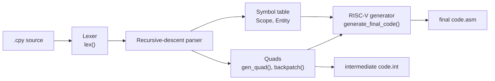

# CutePy Compiler (educational programming language)

A compiler written in Python for CutePy, a small Python-like language made for teaching. It translates CutePy source code into intermediate code (quadruples) and RISC-V assembly.


**From source to assembly** ([examples/gcd.cpy](examples/gcd.cpy)):

<table>
<tr><th>CutePy source</th><th>Intermediate code (quads)</th><th>RISC-V (excerpt)</th></tr>
<tr>
<td>

```python
def main_gcd():
#{
    #declare a, b, r
    a = int(input());
    b = int(input());
    while (b != 0):
    #{
        r = a - (a // b) * b;
        a = b;
        b = r;
    #}
    print(a);
#}
if __name__ == "__main__":
    main_gcd();
```

</td>
<td>

```text
0 begin_block main_gcd _ _
1 inp a _ _
2 inp b _ _
3 != b 0 5
4 jump _ _ 12
5 // a b T_1
6 * T_1 b T_2
7 - a T_2 T_3
8 = T_3 _ r
9 = b _ a
10 = r _ b
11 jump _ _ 3
12 out a _ _
13 halt _ _ _
14 end_block main_gcd _ _
```

</td>
<td>

```asm
L3:
    lw t1, -16(s0)
    li t2, 0
    bne t1, t2, L5
L4:
    j L12
L5:
    lw t1, -12(s0)
    lw t2, -16(s0)
    div t1, t1, t2
    sw t1, -24(s0)
...
L11:
    j L3
```

</td>
</tr>
</table>

## About

- **Context:** Compilers course, Department of Computer Science & Engineering, University of Ioannina
- **Team:** Team project (2 students)
- **Status:** Complete as a course project. See [Limitations](#limitations-and-next-steps).

The course asked for a complete compiler for CutePy, written in plain Python with no parser generators or other compiler tools. CutePy supports integers, `if`/`else`, `while`, nested functions, recursion and pass-by-value parameters. The compiler does everything in a single pass: a hand-written lexer and a recursive-descent parser check the program, and generate intermediate code, fill a symbol table and emit RISC-V assembly for each function as it is parsed.

## The language

CutePy programs are also valid Python programs. Blocks are written as `#{ ... #}` and declarations as `#declare x, y`, which Python reads as comments. A program defines one or more `main_` functions and then calls them from `if __name__ == "__main__":`.

The full description is in [docs/language.md](docs/language.md).

## Features

- **Lexer:** keywords, identifiers (up to 30 characters), integer constants (range-checked), operators, `#$ ... #$` comments, line tracking for error messages
- **Parser:** recursive descent, one function per grammar rule, stops at the first syntax error with the line number
- **Intermediate code:** quadruples for expressions, assignments, `if`/`else`, `while`, input/output, function calls and returns. Boolean conditions (`and`, `or`, `not`) use true/false lists and backpatching.
- **Symbol table:** scopes with nesting levels, variables, parameters, temporaries and functions, and stack-frame offsets. Detects undeclared variables.
- **RISC-V code generation:** loads and stores for local, global and enclosing-function variables (through access links), arithmetic, branches, parameter passing and calls

## Tech stack

- **Language:** Python 3 (standard library only)
- **Target:** RISC-V assembly
- **Tools:** unittest, GitHub Actions

## How it works



1. **Lexer** (`lex()`): reads the source one character at a time and returns the next token and its family (identifier, keyword, number, operator, delimiter). The parser calls it on demand. When the parser needs to look ahead, it saves the file position and seeks back to it.
2. **Parser** (`startRule()` to `bool_factor()`): one function per grammar rule. The parser also drives code generation (syntax-directed translation).
3. **Intermediate code:** each quad is `operator, x, y, z`, for example `+ a 1 T_2`. Jumps whose targets aren't known yet are collected in lists and filled in later by `backpatch()`.
4. **Symbol table:** each function opens a `Scope` at a new nesting level. Each variable, parameter and temporary gets a 4-byte offset in the function's stack frame.
5. **Final code:** when a function's block ends, its quads are translated to RISC-V. `loadvr()` and `storerv()` pick the right addressing:
   - local variables relative to `sp`
   - global variables (declared in the `main_` function) relative to `s0`
   - variables of enclosing functions through the access-link chain built by `gnvlcode()`

### Design decisions

- **Hand-written recursive-descent parser instead of a parser generator:** the course required plain Python. It also maps each grammar rule to one readable function. Trade-off: more code, and error recovery is hard, so the parser stops at the first error.
- **One pass, no AST:** quads are generated while parsing, and each function's assembly is written as soon as the function ends. This keeps memory use low and the compiler simple. Trade-off: no room for optimization passes or for semantic checks that need the whole program.
- **Backpatching for control flow:** conditions produce lists of unfinished jumps, which are completed once the target quad is known. This avoids a second pass over the code.
- **Access links for nested functions:** a function can read variables of its enclosing functions, so each stack frame stores a link to its parent's frame (Pascal-style static scoping). Trade-off: access to outer variables costs one load per nesting level.

## Getting started

### Prerequisites

- Python 3.11 or newer. There are no other dependencies.

### Installation

```bash
git clone https://github.com/KonstantinosChatzopoulos/cutepy-compiler.git
cd cutepy-compiler
```

### Run

```bash
python compilers.py examples/gcd.cpy
```

The compiler writes two files to the current directory:

- `intermediate code.int`: the quads
- `final code.asm`: the RISC-V assembly

The input file must end in `.cpy`.

## Usage

The [examples/](examples/) folder has three programs. Next to each one are the `.int` and `.asm` files the compiler produced from it:

| Program | Shows |
|---|---|
| [gcd.cpy](examples/gcd.cpy) | `while` loop, integer arithmetic, input and output |
| [power.cpy](examples/power.cpy) | A recursive local function with two parameters |
| [nested_scopes.cpy](examples/nested_scopes.cpy) | Functions nested two levels deep; `and`/`not` conditions; access to a variable of the `main_` function |

Invalid programs are rejected with a message and a line number:

```text
$ python compilers.py tests/errors/missing_semicolon.cpy
; expected after expression in line 4
```

## Tests

```bash
python -m unittest discover -s tests -v
```

- Each example is compiled and its output is compared with the saved `.int` and `.asm` files.
- Nine invalid programs in [tests/errors/](tests/errors/) must be rejected with the expected message. They cover an illegal character, a missing `#}`, a missing `;`, a missing relational operator, a bad main-function name, a nested main function, an identifier that is too long, a number out of range and an undeclared variable.
- Command-line errors: no file given, wrong extension, file not found.

GitHub Actions runs the tests on Python 3.11 and 3.14 on every push.

## Project structure

```text
cutepy-compiler/
├── compilers.py              # the compiler: lexer, parser, quads, symbol table, RISC-V generation
├── examples/                 # sample programs and their generated .int / .asm files
├── tests/
│   ├── test_compiler.py      # regression tests
│   └── errors/               # invalid programs
├── docs/language.md          # the CutePy language
└── .github/workflows/ci.yml  # CI
```

## What I learned

- How the classic compiler phases fit together, and what it takes to connect them in a single pass
- Writing a recursive-descent parser directly from a grammar
- Generating intermediate code for boolean conditions with true/false lists and backpatching
- Designing a symbol table for nested scopes, and computing stack-frame offsets
- Reaching variables of enclosing functions at run time through access links in RISC-V

## Limitations and next steps

The lexer, parser and symbol table handle the whole language. The intermediate code has one known bug (`if`/`else`), and the RISC-V back end is incomplete. As a result, the generated assembly has not been run in a RISC-V simulator.

Known limitations:

- **Function returns:** `end_block` emits no `jr ra`, and `retv` stores the result but doesn't jump to the end of the function.
- **Input and program start:** `inp` reads a number but doesn't store it in the variable. The main function has no stack setup, and `halt` puts the exit system-call number (10) in `a0` instead of `a7`.
- **`if`/`else`:** the jump at the end of the `if` branch goes to the start of the `else` branch instead of past it. `if` without `else` is correct.
- **Sibling local functions:** two local functions at the same nesting level share one scope record in the symbol table, so the second one gets wrong stack offsets.
- **Output files:** the output always goes to `intermediate code.int` and `final code.asm` in the current directory.
- **Errors:** compilation stops at the first error. Some messages point to the next token, for example a missing `#}` is reported at the following `if`.

Next steps: fix the items above, write the output next to the input file, and run the examples in a RISC-V simulator (e.g. RARS) as part of CI.

## Acknowledgments

- The CutePy language and its specification were designed by the course instructor for the Compilers course. The specification isn't included in this repo; [docs/language.md](docs/language.md) is our own summary.
- AI assistance: the README, documentation, code comments, examples and tests were prepared with AI assistance. The compiler is our original work.

## License

Released under the [MIT License](LICENSE).
